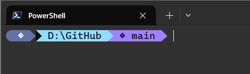
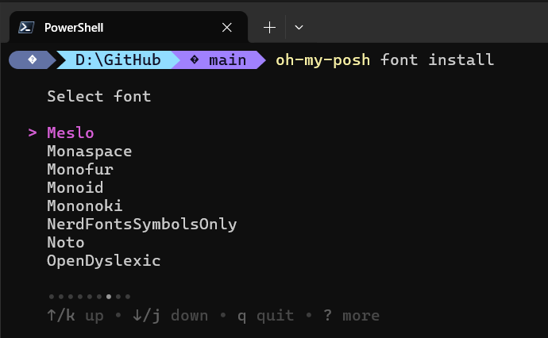
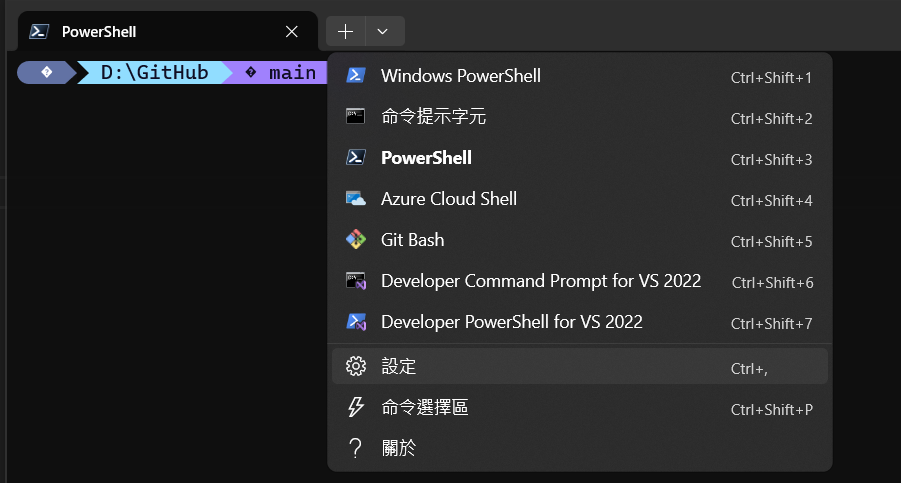
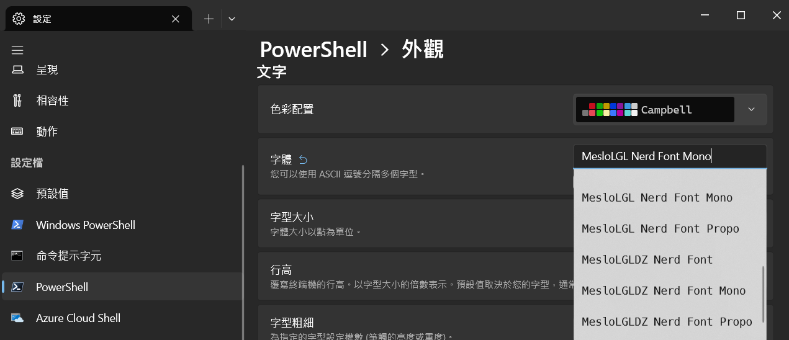
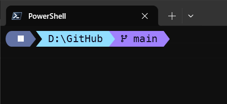
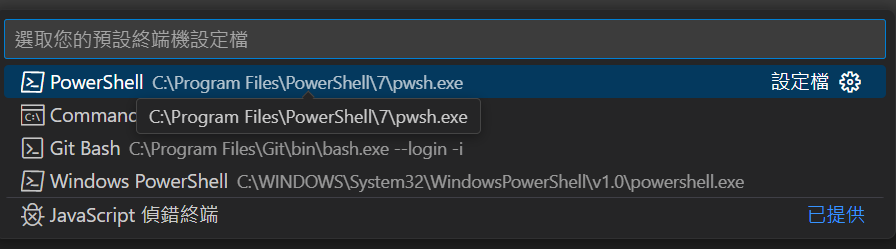
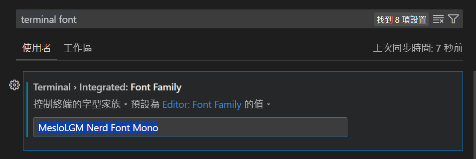
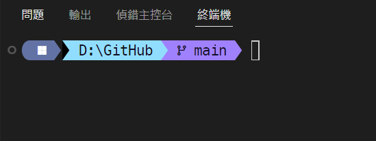
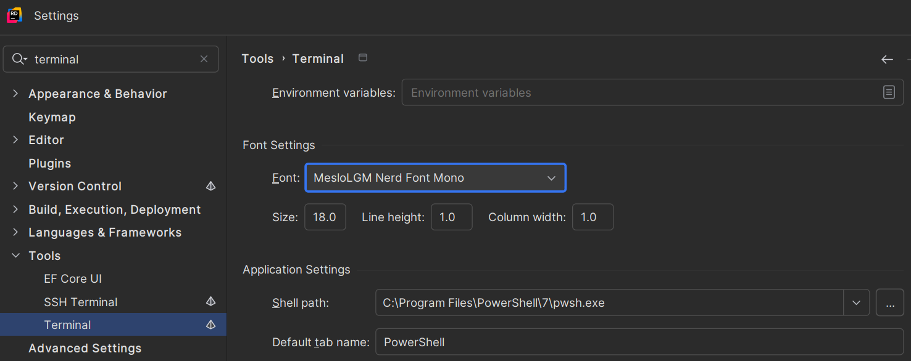
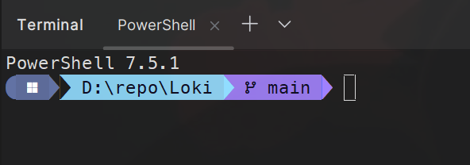

:::info no-icon
每次照著人家的文章設定 oh my posh 想更改 terminal 的樣式，最後總是以失敗告終
這兩天重新嘗試了一下，終於設定成功，寫個文章記錄一下
:::


## 安裝 powshell 7

oh-my-posh 沒辦法在傳統的 windows powershell 使用，必須使用新版的 powershell 7 才有辦法生效

安裝方式可參考 [微軟官方文件](https://learn.microsoft.com/zh-tw/powershell/scripting/install/installing-powershell-on-windows)


> 同場加映，推薦到 Microsoft Store 安裝 [Windows Terminal](https://apps.microsoft.com/detail/9N0DX20HK701?hl=zh-tw&gl=TW&ocid=pdpshare) 來執行 powershell 、 cmd 、git Bash 等工具，介面比 windows 傳統終端機好看很多

## 安裝 oh my posh

以系統管理員模式打開 powershell 後，下方指令擇一下載

1. winget
```sh
winget install JanDeDobbeleer.OhMyPosh -s winget
```

2. choco
```sh
choco install oh-my-posh
```

3. PowerShell
```sh
Set-ExecutionPolicy Bypass -Scope Process -Force; Invoke-Expression ((New-Object System.Net.WebClient).DownloadString('https://ohmyposh.dev/install.ps1'))
```

安裝好後應該會自動將 oh my posh 環境變數加到系統，可以先重新啟動電腦，讓環境變數生效

## 找一個路徑新增 json 檔案


```json .oh-my-posh.omp.json
{
  "$schema": "https://raw.githubusercontent.com/JanDeDobbeleer/oh-my-posh/main/themes/schema.json",
  "blocks": [
    {
      "type": "prompt",
      "alignment": "left",
      "segments": [
        {
          "background": "#6272a4",
          "foreground": "#ffffff",
          "leading_diamond": "\ue0b6",
          "trailing_diamond": "\ue0b0",
          "style": "diamond",
          "type": "os"
        },
        {
          "type": "path",
          "foreground": "#100e23",
          "background": "#91ddff",
          "style": "powerline",
          "properties": {
            "style": "full"
          },
          "powerline_symbol": "\ue0b0"
        },
        {
          "type": "git",
          "foreground": "#100e23",
          "background": "#a081fd",
          "style": "powerline",
          "template": "  {{ .HEAD }} ",
          "properties": {
            "branch_icon": ""
          },
          "powerline_symbol": "\ue0b0"
        }
        // ,{
        //   "properties": {
        //     "cache_duration": "none"
        //   },
        //   "template": " \uf308 {{ .Context }}{{ if .Namespace }} \u2192 {{ .Namespace }}{{ end }} ",
        //   "foreground": "#100e23",
        //   "powerline_symbol": "\ue0b0",
        //   "background": "#79b0fe",
        //   "type": "kubectl",
        //   "style": "powerline"
        // }
      ]
    }
  ],
  "version": 3,
  "final_space": true
}
```



> 註解的部分是 k8s 設定，可依照需求新增/移除

## 改設定

用記事本打開你目前 PowerShell 的 個人設定檔（Profile）

```sh
notepad $PROFILE
```

將下列指令貼上，記得路徑要更改成 json 檔案放置路徑

```
oh-my-posh init pwsh --config "E:\.oh-my-posh.omp.json" | Invoke-Expression
```

如果都成功之後，再次開啟終端機，應該就能看見畫面變了




出現奇怪符號的原因是，字體無法顯示 Unicode 字元的關係 

## 安裝與更改字型

1. 輸入指令  
```sh
oh-my-posh font install
```

2. 選擇 Meslo   



3. 設定  



4. 到 powershell > 外觀，將字體更改成 **Meslo** 開頭的選項  



5. 完成  




## 更改 vs code 預設程式與字體

如同前言，使用 oh my posh 先決條件必須使用 powershell 7  
而 vscode 終端機預設的程式可能是 cmd (命令提示字元)，所以我們得先將預設程式更改成 PowerShell


### 更改 vs code 預設程式
1. 輸入 `f1` 或 `ctrl` + `shift` + `P`

2. 輸入 **select default profile**

3. 選擇 PowerShell  


> 注意不要選到 windows powershell ，那是不同的版本的終端機
### 更改字體

1. 到設定輸入 `terminal font`


2. 輸入喜歡的字體，如同前文 windows terminal 那樣，這裡是設定 `MesloLGM Nerd Font Mono`  



3. 完成效果    


## 更改 rider 字體

這裡 Rider 使用的版本是：  
JetBrains Rider 2025.1.2

步驟：

1. 到設定，搜尋 terminal
2. 將字體、shell 工具分別設定好  


3. 完成效果  
